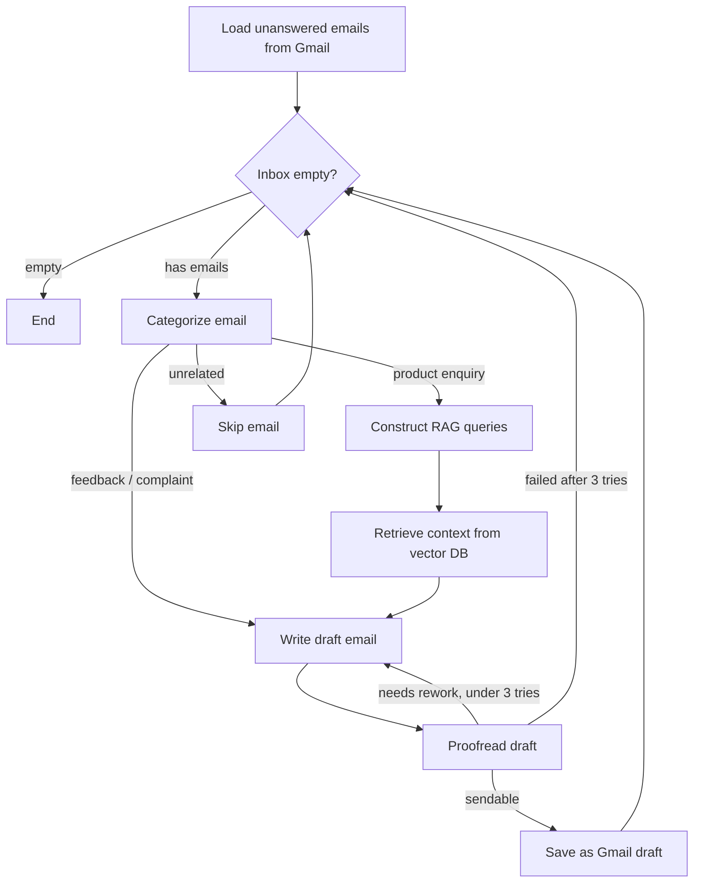

# 📧 AI Email Assistant — Autonomous Gmail Responder built with LangGraph

An agentic pipeline that reads incoming Gmail messages, categorizes them, pulls relevant context from a company knowledge base (RAG), drafts a reply, **proofreads its own draft**, and rewrites it (up to 3 times) before saving it as a Gmail draft — all without human intervention until send-time.

This isn't a single LLM call — it's a **stateful multi-agent workflow** built on [LangGraph](https://github.com/langchain-ai/langgraph), with self-correction, conditional routing, and structured outputs at every step.

---

## 🧠 How it works



**Pipeline stages:**

| Stage | What happens |
|---|---|
| **Fetch** | Pulls unanswered threads from Gmail (last 8h window), skipping ones that already have a draft reply |
| **Categorize** | An LLM classifies the email as *product enquiry*, *feedback/complaint*, or *unrelated* |
| **RAG retrieval** | For product questions, the agent designs its own search queries and retrieves relevant chunks from a Chroma vector store built from company docs |
| **Draft** | A writer agent composes a reply using the email + retrieved context |
| **Proofread** | A separate proofreader agent reviews the draft against the original email and either approves it or sends it back with feedback |
| **Self-correction loop** | Rejected drafts are rewritten (max 3 attempts) using the proofreader's feedback as extra context |
| **Output** | Approved replies are saved as Gmail drafts (never auto-sent — a human reviews before hitting send) |

---

## 🛠️ Tech Stack

- **Orchestration:** LangGraph (StateGraph, conditional edges, cyclic self-correction)
- **LLMs:** Ollama (local `llama3`) — swappable for Groq / Gemini (both already wired in)
- **RAG:** ChromaDB + `nomic-embed-text` embeddings
- **Structured outputs:** Pydantic schemas via `with_structured_output` for every agent (no fragile string parsing)
- **Gmail integration:** Google API Python client with OAuth2, MIME reply threading (`In-Reply-To` / `References` headers), HTML + plaintext email construction
- **UI:** Streamlit demo app
- **Other:** BeautifulSoup (HTML email body extraction), python-dotenv, colorama (console logging)

---

## 📂 Project Structure

```
email-automation-langgraph/
├── main.py                  # CLI entry point — runs the LangGraph workflow once
├── create_index.py          # Builds the Chroma vector index from data/agency.txt
├── streamlit_app.py         # Interactive UI for demoing the pipeline
├── data/
│   └── agency.txt           # Sample knowledge base (swap with your own docs)
├── src/
│   ├── state.py             # GraphState & Email schemas
│   ├── graph.py             # LangGraph workflow definition (nodes + edges)
│   ├── nodes.py             # Node logic — one function per pipeline stage
│   ├── pipelines.py         # Agent definitions (LLM chains per task)
│   ├── prompts.py           # All prompt templates
│   ├── structure_out.py     # Pydantic output schemas for structured generation
│   └── gmailtools.py        # Gmail API wrapper (fetch, draft, send, MIME handling)
└── tools/
    └── basic_gmail.py       # OAuth credentials / token storage location
```

---

## 🚀 Getting Started

### 1. Clone and install
```bash
git clone <your-repo-url>
cd email-automation-langgraph
python -m venv venv && source venv/bin/activate
pip install -r requirements.txt
```

### 2. Set up Ollama (local LLM + embeddings)
```bash
ollama pull llama3
ollama pull nomic-embed-text
```

### 3. Gmail API credentials
1. Create a project in [Google Cloud Console](https://console.cloud.google.com/), enable the Gmail API
2. Create OAuth 2.0 credentials (Desktop App) and download as `tools/credentials.json`
3. First run will open a browser to authorize — a `token.json` will be saved automatically

### 4. Add your knowledge base and build the index
Replace `data/agency.txt` with your own product/company docs, then:
```bash
python create_index.py
```

### 5. Configure environment
Create a `.env` file:
```
MY_EMAIL=you@example.com
```

### 6. Run it
```bash
python main.py              # single pass over the inbox
streamlit run streamlit_app.py   # interactive demo UI
```

---

## ⚠️ Notes & Limitations

- Replies are saved as **Gmail drafts only** — nothing is auto-sent, by design.
- Currently runs as a single-pass script; scheduling (cron / GitHub Actions) would be needed for continuous operation.
- Default LLM is local (Ollama) for zero API cost during development — Groq/Gemini clients are already included in `requirements.txt` for a cloud-hosted version.

## 🗺️ Possible Next Steps

- Add automated tests for the routing/categorization logic
- Swap in a hosted LLM provider for a live public demo
- Add a scheduler for continuous polling instead of single-pass runs
- Expand the RAG source beyond a single text file (multi-doc ingestion)

---

## 📄 License

MIT
